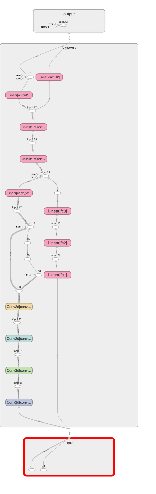

# SESSION 2.5:

#### Todo:

Write a neural network that can:

1. take 2 inputs:

   1. an image from the MNIST dataset **(say 5),** and
   2. a random number between 0 and 9, **(say 7)**

2. and gives two outputs:

   1. the "number" that was represented by the MNIST image (predict 5), and

   2. the "sum" of this number with the random number and the input image to the network (predict 5 + 7 = 12)

      



### Notes:

1. data representation: MNIST data is [1x28x28], random number is [1]
2. data generation strategy (basically the class/method you are using for random number generation):
   1. Created a custom Dataset class (see below)
   2. Used `torch.randint(0, 9, (1,), dtype=torch.float32, device=device)`
   3. And MNIST dataset (from torchvision.datasets) within custom class `MyDataset(Dataset)`
3. how you have combined the two inputs (basically which layer you are combining):
   1. First image input has multiple Convolutional layers (4) which results in image size to be 20x20 and that combined with 64 channels leads to 20 * 20 * 64 output size
   1. This 20 * 20 * 64 was connected to a fully connected layer with input 20 * 20 * 64 and output 256 (call this layer `conv_fc1`).
   1. The number input starts with a separate path to full connected layers with input of `1` to`16`  **->** `16 to 32` **->**  `32 to 64` (last layer here is `fc3`)
   1. `fc_combined_1` FC layer takes input from output of `conv_fc1` and`fc3` which is 256 + 64 as input correspondingly and outputs 256 nodes
   1. `fc_combined_2` is another normal FC layers going from previous 256 to 256 -> just adding a layer to add more learning power and outputs 256 nodes
   1. `output1` takes input from `fc_combined_2` i.e. 256 size and outputs `10` nodes 
   1. `output2` also takes input from `fc_combined_2` i.e. 256 size input and outputs `5` nodes
   1. So data is merged at `fc_combined_1` (256 output from conv to fc-layer's output and 64 from fc layers)
4. how you are evaluating your results:
   1. Loss is combined from prediction of MNIST and the number
   2. For now decrease in loss and increase in correct predictions with epochs was considered
5. must mention "what" results you finally got and how did you evaluate your results
6. *mention what loss function you picked and why!*:

   1. First loss function used for MNIST classification is categorical cross_entopry

   2. Second loss function is Binary Cross-entropy

   3. `nn.CrossEntropyLoss` uses the target to index the logits in the model’s output. Thus it is suitable for multi-class classification use cases (only one valid class in the target).`nn.BCEWithLogitsLoss` on the other hand treats each output independently and is suitable for multi-label classification use cases (Internally uses Sigmoid hence no Sigmoid at last layer's second part for number prediction).


#### Dataset class:

```python
class MyDataset(Dataset):
    def __init__(self, root="./data", to_train=True, transform=None):
        super().__init__()

        if not transform:
            transform = transforms.Compose([transforms.ToTensor()])

        self.mnist_data = MNIST(
            root=root,
            train=to_train,
            transform=transform,
            download=True)

    def __getitem__(self, index_to_fetch):
        image, target = self.mnist_data.__getitem__(index_to_fetch)
        random_num = torch.randint(0, 9, (1,), dtype=torch.float32, device=device)

        label_plus_random_num_encoded = encoding(target + random_num)

        return image, target, random_num, label_plus_random_num_encoded

    def __len__(self):
        return len(self.mnist_data)
```


#### Network:

```python
class Network(nn.Module):
    @staticmethod
    def _get_conv_layer(in_features, out_features, kernel_size=3):
        return nn.Conv2d(in_channels=in_features, out_channels=out_features, kernel_size=kernel_size, bias=False)

    def __init__(self):
        super().__init__()
        self.conv1 = Network._get_conv_layer(in_features=1, out_features=32)
        self.conv2 = Network._get_conv_layer(in_features=32, out_features=32)
        self.conv3 = Network._get_conv_layer(in_features=32, out_features=64)
        self.conv4 = Network._get_conv_layer(in_features=64, out_features=64)

        self.conv_fc1 = nn.Linear(20 * 20 * 64, 256, bias=False)
        # self.conv_fc2 = nn.Linear(256, 256, bias=False)

        self.fc1 = nn.Linear(in_features=1, out_features=16, bias=False)
        self.fc2 = nn.Linear(16, 32, bias=False)
        self.fc3 = nn.Linear(32, 64, bias=False)

        self.fc_combined_1 = nn.Linear(256 + 64, 256, bias=False)
        self.fc_combined_2 = nn.Linear(256, 256, bias=False)
        # self.fc_combined_3 = nn.Linear(256, 10+5)
        self.output1 = nn.Linear(256, 10, bias=False)
        self.output2 = nn.Linear(256, 5, bias=False)

    def forward(self, x, y):
        x = F.relu(self.conv1(x))
        x = F.relu(self.conv2(x))
        x = F.relu(self.conv3(x))
        x = F.relu(self.conv4(x))
        x = x.view(x.size(0), -1)
        x = self.conv_fc1(F.relu(x))
        # x = self.conv_fc2(F.relu(x))

        y = F.relu(self.fc1(y))
        y = F.relu(self.fc2(y))
        y = F.relu(self.fc3(y))

        z = torch.concat([x, y], dim=1)
        z = F.relu(self.fc_combined_1(z))
        z = F.relu(self.fc_combined_2(z))

        out1 = self.output1(z)
        out2 = self.output2(z)
        return F.softmax(out1, dim=1), out2
```


#### Training logs:

epoch 0 total_correct: 44996 total_loss: 1300.1660875082016 mnist_preds_correct: 94 numbers_preds_correct: 0

epoch 1 total_correct: 55326 total_loss: 1091.2714015245438 mnist_preds_correct: 97 numbers_preds_correct: 0 

epoch 2 total_correct: 56472 total_loss: 1026.0892226696014 mnist_preds_correct: 97 numbers_preds_correct: 0 

epoch 3 total_correct: 57110 total_loss: 989.8685375452042 mnist_preds_correct: 98 numbers_preds_correct: 0 

epoch 4 total_correct: 56937 total_loss: 977.7223862409592 mnist_preds_correct: 98 numbers_preds_correct: 0